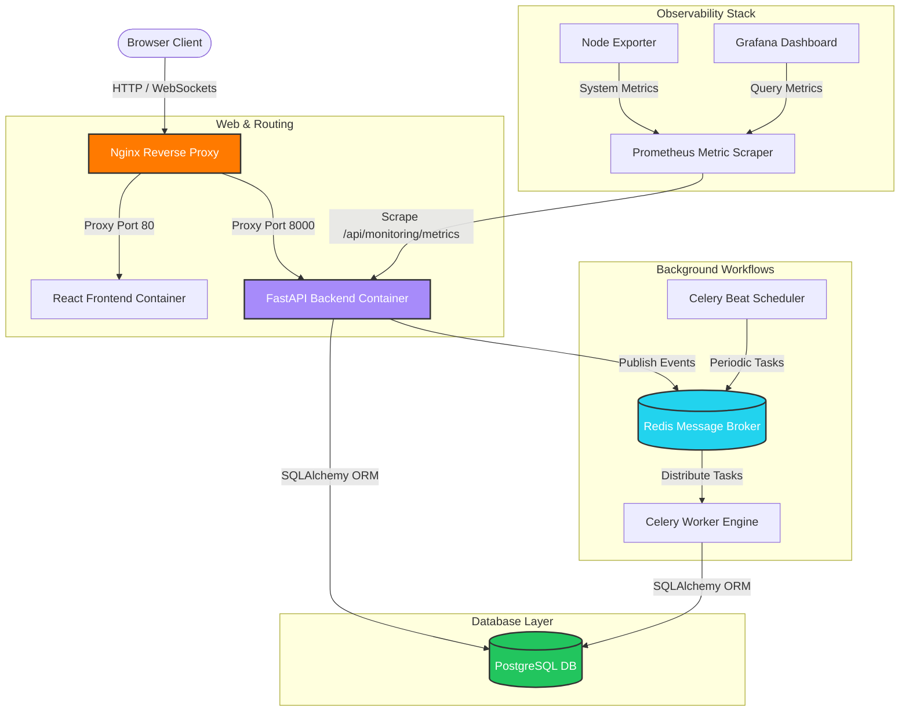
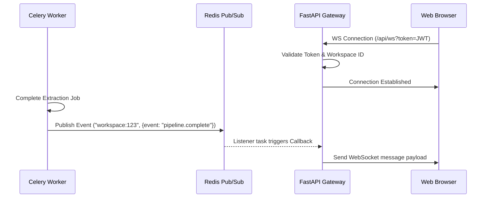

# DataForge AI — System Architecture

This document details the system architecture, component relationships, data flow patterns, and deployment topologies of the DataForge AI platform.

---

## 🏢 Container Architecture

DataForge AI is containerized as a multi-service architecture using Docker Compose. The diagram below illustrates the relationship between the front-facing gateway, application servers, asynchronous workers, and persistent stores:



### Container Profiles & Specifications
1. **Nginx Reverse Proxy**: Binds to host port `80`. Routes ingress `/api` traffic to the backend, standard traffic to the React static server, and supports HTTP upgrade protocols for WebSockets.
2. **React Frontend**: Served via an internal Nginx container running node-optimized SPA static fallback routing.
3. **FastAPI Backend**: ASGI python application running under a non-privileged `dataforge` user. Exposes API endpoints and the WebSocket gateway.
4. **Celery Worker**: Background task executor running the same codebase but running under the Celery worker CMD.
5. **Celery Beat**: Periodic scheduler running low-frequency maintenance pipelines (e.g., node health, notifications).
6. **Redis**: Alpine-based in-memory broker handling Celery tasks queue and FastAPI websocket broadcast Pub/Sub channels.
7. **PostgreSQL**: Transactional repository utilizing standard volumes for data persistence.
8. **Prometheus**: Metric aggregator scraping node and backend telemetry.
9. **Grafana**: Web dashboard pre-configured with default metric datasources and system views.
10. **Node Exporter**: Collects system metrics from the host container machine.

---

## ⚙️ Backend Architecture

The backend FastAPI application follows a clean modular design divided by domains:

```
backend/src/
├── __init__.py
├── main.py                # Application factory, middleware & routing setup
├── celery_app.py           # Celery worker application & task registration
├── auth/                   # Users, workspaces, JWT validation, credentials
│   ├── models.py
│   ├── router.py
│   ├── schemas.py
│   └── service.py
├── projects/               # Workspace project management configurations
├── datasets/               # Schema discovery, file uploads, dataset metadata
├── extraction/             # Ingestion pipelines and AI extraction engines
├── pipelines/              # Task flow orchestration & pipelines definitions
├── copilot/                # Chatbot agents & LLM interactions
├── monitoring/             # System events logging & statistics
└── core/                   # Shared system utilities
    ├── config.py           # Settings loader utilizing Pydantic Settings
    ├── database.py         # SQLAlchemy engine session context managers
    ├── logging_config.py   # Structured JSON logger formatter
    ├── observability.py    # Sentry hooks and Prometheus metrics
    ├── websockets.py       # User room WebSocket connection manager
    └── redis_pubsub.py     # Redis listener bridging events to WebSockets
```

### Module Isolation
* **Core**: Supplies shared database handles, websockets room registries, environment structures, and JSON logging.
* **Services**: Perform database transactions and orchestrate AI integrations.
* **Routers**: Map HTTP verbs to controller functions, parsing Pydantic request models.

---

## 🎨 Frontend Architecture

The React frontend utilizes a structured layout system built on Tailwind v4 and React Router v6:

```
frontend/src/
├── App.tsx                 # Core Router mapping and layout wrapping
├── index.css               # Core styling tokens and color themes
├── main.tsx                # React virtual DOM bootstrap entrypoint
├── components/             # Reusable global design UI items
│   ├── ui/                 # Card, Button, Badge, Table, Input primitives
│   └── layout/             # Sidebar, Navbar, AppShell
├── lib/                    # Client utility methods and constants
│   ├── api.ts              # Axios HTTP client configuration
│   ├── constants.ts        # Color codes, routes list, fallback stats
│   └── utils.ts            # Class merging and formatting functions
├── store/                  # Client stores utilizing Zustand
│   ├── authStore.ts
│   ├── uiStore.ts
│   └── agentStore.ts
└── pages/                  # Page containers loaded via React.lazy()
    ├── Landing/            # Public marketing landing overview
    ├── Auth/               # Login & Register views
    └── Dashboard/          # Core operations visualization
```

### Styling Theme System
All dashboard layouts leverage a strict design system defined in `frontend/src/index.css`:
- **Glassmorphic Surface**: Base styles are applied via `.card-glass` containing `backdrop-blur-md` and semi-transparent dark borders.
- **Harmonious Accent Palette**: Limited strictly to:
  - Orange: `#FF7A00` (`--color-orange`)
  - Green: `#22C55E` (`--color-green`)
  - Cyan: `#22D3EE` (`--color-cyan`)
  - Purple: `#A78BFA` (`--color-purple`)

---

## 🔄 Data Flows & Pipelines

### Real-Time Event Stream Pipeline
DataForge AI synchronizes agent performance metrics and project changes to the browser in real time without continuous HTTP polling:



### Relational Database Model
The schema handles workspace tenancy, API keys, and pipeline execution logs:

```
User (1) ───< (N) WorkspaceMembership (N) >─── (1) Workspace
                                                       │
               ┌───────────────────────────────────────┴───────────────────────────────────────┐
               ▼                                       ▼                                       ▼
         APIKey (1..N)                         Pipeline (1..N)                               Dataset (1..N)
                                                       │
                                                       ▼
                                              PipelineRun (1..N)
```

1. **User**: Credentials, profiles, and billing properties.
2. **Workspace**: Tenancy isolation. All pipelines, datasets, and operations are locked to a Workspace.
3. **WorkspaceMembership**: Pivot table mapping user roles (`admin`, `member`, `viewer`) within individual workspaces.
4. **APIKey**: Scoped keys generated for automated backend integrations.
5. **Dataset**: Metadata, database schemas, and references to actual file storage.
6. **Pipeline**: Data workflow configurations containing a series of sequential extraction/cleaning steps.
7. **PipelineRun**: Execution logs recording statuses (`running`, `success`, `failed`), timestamps, and error messages.
